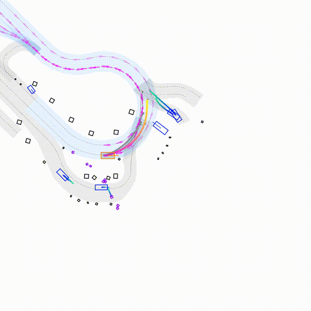

# 250711 자동차공학회워크샵 nuPlan 실습 강의

## Setup Environment

### Setup conda environment
```
conda create -n nuplan_py39 python=3.9
conda activate nuplan_py39

git clone https://github.com/motional/nuplan-devkit.git && cd nuplan-devkit
pip install -e .
pip install -r ./requirements.txt

cd ..
git clone https://github.com/ailab-hanyang/nuPlan_practice.git && cd nuPlan_practice
pip install -r ./requirements.txt
```

### Setup dataset

nuPlan 샘플 데이터셋 다운로드 폴더: [AILAB_nuPlan_sample_dataset](https://drive.google.com/drive/folders/1D8lHmoZef5FZLH8IT-tyoo-NAbh3jHbg?usp=sharing)

nuPlan 전체 데이터셋 다운로드 폴더: [offiical-doc](https://nuplan-devkit.readthedocs.io/en/latest/dataset_setup.html)

- 데이터셋 다운 후 nuPlan_practice/ 에서 unzip 진행
- nuPlan_practice/nuplan_dataset/ 내 데이터 잘 unzip 되었는지 확인

### 환경 구성 시 유의해야 할 점
#### requirements.txt 설치 시 버전 에러 발생하면 해당 패키지 주석 후 재실행
- 에러 발생 패키지는 본인 cuda 환경에 맞는 버전으로 설치 진행

#### 추가 설치 필요 패키지 1: torch 
- 본인 cuda version에 맞는 torch 설치 (추천 버전[검증된 환경]: 1.12.0 ~ 2.2.0 사이)

##### 설치 명령어 참고 경로: https://pytorch.org/get-started/previous-versions/ 

#### 추가 설치 필요 패키지 2: natten (neighborhood attention)
- 만약 본인의 설치 torch version이 2점대 이면 natten version 0.17.0 추천
- 만약 본인의 설치 torch version이 1점대 이면 natten version 0.14.6 추천

##### 설치 명령어 
```
# torch version 2.2.x, cuda version 12.1일 시
pip3 install natten==0.17.0+torch220cu121 -f https://shi-labs.com/natten/wheels 

# torch version 1.13.x, cuda version 11.6일 시
pip3 install natten==0.14.6+torch1130cu116  -f https://shi-labs.com/natten/wheels
```

#### 추가 설치 필요 패키지 3: imageio 
- closed-loop 추론 시각화 목적

설치 명령어
```
pip install imageio
pip install imageio[ffmpeg]
```

## Training

### 환경 변수 설정 및 등록
```
cd nuPlan_practice/
export NUPLAN_MAPS_ROOT=$PWD/nuplan_dataset/dataset/maps
export NUPLAN_DATA_ROOT=$PWD/nuplan_dataset/dataset
export NUPLAN_EXP_ROOT=$PWD/nuplan_dataset/exp
PYTHONPATH=$PYTHONPATH:$PWD/
```

### Train Command

```bash
CUDA_VISIBLE_DEVICES=0 python run_training.py \
     py_func=train +training=train_pluto \
     worker=single_machine_thread_pool worker.max_workers=1 \
     scenario_builder=nuplan \
     cache.cache_path=$PATH_TO_nuPlan_practice/nuplan_dataset/exp/cache_pluto_sanity_check cache.use_cache_without_dataset=true \
     data_loader.params.batch_size=1 data_loader.params.num_workers=1 \
     lr=1e-3 epochs=150 warmup_epochs=3 weight_decay=0.0001
```

### Training 결과 분석
- checkpoint 및 학습 log 경로 : $PWD/nuplan_dataset/exp/exp/training/pluto 

## Checkpoint
-학습 
Download and place the checkpoint in the `/checkpoints` folder.

| Model            | Download |
| ---------------- | -------- |
| Pluto-1M-aux-cil | [OneDrive](https://hkustconnect-my.sharepoint.com/:u:/g/personal/jchengai_connect_ust_hk/EaFpLwwHFYVKsPVLH2nW5nEBNbPS7gqqu_Rv2V1dzODO-Q?e=LAZQcI)    |


## Inference
### Inference(simulation) Command 
```bash
sh ./script/run_pluto_planner.sh pluto_planner nuplan training_scenarios_sample pluto_1M_aux_cil.ckpt /video_closed_loop_result
```

The rendered simulation video will be saved to the specified directory (need to create floder `./video_closed_loop_result`).

### Closed-Loop Inference 영상



-------------------Original Repository------------------


# PLUTO

This is the official repository of

**PLUTO: Push the Limit of Imitation Learning-based Planning for Autonomous Driving**,

[Jie Cheng](https://jchengai.github.io/), [Yingbing Chen](https://sites.google.com/view/chenyingbing-homepage), and [Qifeng Chen](https://cqf.io/)


<p align="left">
<a href="https://jchengai.github.io/pluto">

</a>
<a href='https://arxiv.org/abs/2404.14327' style='padding-left: 0.5rem;'>
    
</a>
</p>

## Setup Environment

### Setup dataset

Setup the nuPlan dataset following the [offiical-doc](https://nuplan-devkit.readthedocs.io/en/latest/dataset_setup.html)

### Setup conda environment

```
conda create -n pluto python=3.9
conda activate pluto

# install nuplan-devkit
git clone https://github.com/motional/nuplan-devkit.git && cd nuplan-devkit
pip install -e .
pip install -r ./requirements.txt

# setup pluto
cd ..
git clone https://github.com/jchengai/pluto.git && cd pluto
sh ./script/setup_env.sh
```

## Feature Cache

```bash 
 export PYTHONPATH=$PYTHONPATH:$(pwd)

 python run_training.py \
    py_func=cache +training=train_pluto \
    scenario_builder=nuplan \
    cache.cache_path=/home/ailab/AILabDataset/01_Open_Dataset/32_nuPlan/nuplan/exp/cache_pluto_debug \
    cache.cleanup_cache=true \
    scenario_filter=training_scenarios_tiny \
    worker.threads_per_node=40
```

## Training

(The training part it not fully tested)

Same, it is recommended to run a sanity check first:
Training on the full dataset (without CIL):

### Train Command
```bash
CUDA_VISIBLE_DEVICES=0,1,2,3 python run_training.py \
  py_func=train +training=train_pluto \
  worker=single_machine_thread_pool worker.max_workers=32 \
  scenario_builder=nuplan cache.cache_path=/home/ailab/AILabDataset/01_Open_Dataset/32_nuPlan/nuplan/exp/cache_pluto_100000 cache.use_cache_without_dataset=true \
  data_loader.params.batch_size=32 data_loader.params.num_workers=16 \
  lr=1e-3 epochs=25 warmup_epochs=3 weight_decay=0.0001 \
  wandb.mode=online wandb.project=nuplan wandb.name=pluto
```

## Debugging 

### Command
```bash
CUDA_VISIBLE_DEVICES=0 python run_training.py \
  py_func=train +training=train_pluto_debug \
  worker=single_machine_thread_pool worker.max_workers=1 \
  scenario_builder=nuplan cache.cache_path=/home/ailab/AILabDataset/01_Open_Dataset/32_nuPlan/nuplan/exp/cache_pluto_debug cache.use_cache_without_dataset=true \
  data_loader.params.batch_size=1 data_loader.params.num_workers=1 \
  lr=1e-3 epochs=25 warmup_epochs=3 weight_decay=0.0001 \
  wandb.mode=disable wandb.project=nuplan wandb.name=pluto
```

### vscode Debugger (.vscode/launch.json)
```json
{
    // Use IntelliSense to learn about possible attributes.
    // Hover to view descriptions of existing attributes.
    // For more information, visit: https://go.microsoft.com/fwlink/?linkid=830387
    "version": "0.2.0",
    "configurations": [
        {
            "name": "Pluto Debugger",
            "type": "debugpy",
            "cwd": "${workspaceFolder}",
            "python": "/home/ailab/.conda/envs/nuplan_py39/bin/python",
            "request": "launch",
            "program": "${workspaceFolder}/run_training.py",
            "console": "integratedTerminal",
            "env": {
                "CUDA_VISIBLE_DEVICES": "0",
                "PYTHONPATH": "${workspaceFolder}:${workspaceFolder}/src:${workspaceFolder}/nuplan"
            },
            "args": [
                "+training=train_pluto_debug",
                "worker=single_machine_thread_pool",
                "worker.max_workers=1",
                "scenario_builder=nuplan",
                "cache.cache_path=/home/ailab/AILabDataset/01_Open_Dataset/32_nuPlan/nuplan/exp/cache_pluto_debug",
                "cache.use_cache_without_dataset=true",
                "data_loader.params.batch_size=1",
                "data_loader.params.num_workers=1",
                "lr=1e-3",
                "epochs=25",
                "warmup_epochs=3",
                "weight_decay=0.0001",
                "wandb.mode=disable",
                "wandb.project=nuplan",
                "wandb.name=pluto"
            ]
        }
    ]
}
```

- add option `model.use_hidden_proj=true +custom_trainer.use_contrast_loss=true` to enable CIL.

- you can remove wandb related configurations if your prefer tensorboard.


## Checkpoint

Download and place the checkpoint in the `pluto/checkpoints` folder.

| Model            | Download |
| ---------------- | -------- |
| Pluto-1M-aux-cil | [OneDrive](https://hkustconnect-my.sharepoint.com/:u:/g/personal/jchengai_connect_ust_hk/EaFpLwwHFYVKsPVLH2nW5nEBNbPS7gqqu_Rv2V1dzODO-Q?e=LAZQcI)    |


## Run Pluto-planner simulation

Run simulation for a random scenario in the nuPlan-mini split

```
sh ./script/run_pluto_planner.sh pluto_planner nuplan_mini mini_demo_scenario pluto_1M_aux_cil.ckpt /dir_to_save_the_simulation_result_video
```

The rendered simulation video will be saved to the specified directory (need change `/dir_to_save_the_simulation_result_video`).

## To Do

The code is under cleaning and will be released gradually.

- [ ] improve docs
- [x] training code
- [x] visualization
- [x] pluto-planner & checkpoint
- [x] feature builder & model
- [x] initial repo & paper

## Citation

If you find this repo useful, please consider giving us a star 🌟 and citing our related paper.

```bibtex
@article{cheng2024pluto,
  title={PLUTO: Pushing the Limit of Imitation Learning-based Planning for Autonomous Driving},
  author={Cheng, Jie and Chen, Yingbing and Chen, Qifeng},
  journal={arXiv preprint arXiv:2404.14327},
  year={2024}
}
```